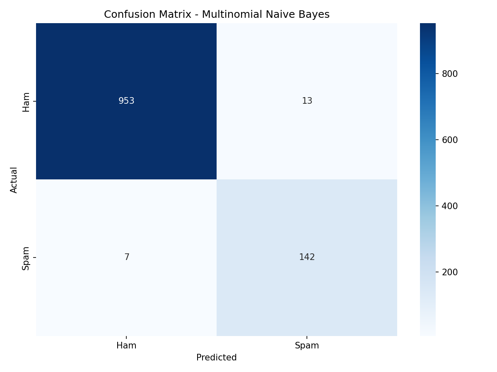
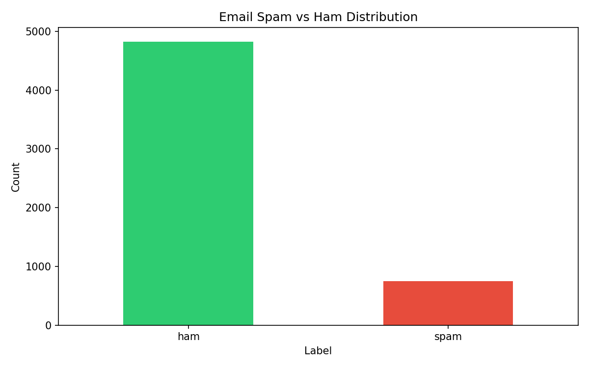

# Email Spam Detection Using Supervised Machine Learning

A machine learning pipeline that classifies SMS/email messages as **spam** or **ham (not spam)** using Natural Language Processing and supervised classification algorithms.

## Overview

This project builds a text classification system trained on the [SMS Spam Collection dataset](https://archive.ics.uci.edu/dataset/228/sms+spam+collection), comparing three classifiers to find the best-performing model for spam detection.

## Dataset

- **Source:** SMS Spam Collection (`spam.csv`)
- **Size:** 5,572 messages
- **Classes:** 4,825 ham | 747 spam (imbalanced)

## Tech Stack

- **Python** — core language
- **Pandas / NumPy** — data handling
- **NLTK** — text preprocessing (stopword removal, stemming)
- **Scikit-learn** — vectorization, model training, evaluation
- **Matplotlib / Seaborn** — visualizations
- **Pickle** — model serialization

## Pipeline

1. **Data Cleaning** — loaded and inspected the dataset, checked for null values
2. **Text Preprocessing (NLP)** — removed punctuation/numbers, lowercased text, removed stopwords, applied Porter Stemming
3. **Feature Extraction** — converted text to numerical features using `CountVectorizer` (Bag-of-Words, 4,000 max features)
4. **Model Training** — trained and compared three classifiers:
   - Random Forest Classifier
   - Decision Tree Classifier
   - Multinomial Naive Bayes
5. **Evaluation** — assessed each model using confusion matrices, accuracy, and classification reports
6. **Model Saving** — serialized the best model and vectorizer with Pickle for reuse

## Results

| Model | Accuracy | Precision (Spam) | Recall (Spam) |
|---|---|---|---|
| Random Forest | 97.76% | 1.00 | 0.83 |
| Decision Tree | 97.22% | 0.91 | 0.88 |
| **Multinomial Naive Bayes** | **98.21%** | **0.92** | **0.95** |

**Best Model: Multinomial Naive Bayes** — highest accuracy and best recall on the spam class, making it the most reliable at actually catching spam messages.

### Confusion Matrix (Naive Bayes)



### Label Distribution



## Project Structure

```
├── email_spam_detection.py       # Main training & evaluation script
├── generate_report.py            # Generates PDF report from script output
├── spam.csv                      # Dataset
├── CountVectorizer.pkl           # Saved vectorizer
├── MNB.pkl                       # Saved Naive Bayes model (best)
├── DTC.pkl                       # Saved Decision Tree model
├── RFC.pkl                       # Saved Random Forest model
├── confusion_matrix_mnb.png      # Confusion matrix visualization
├── label_distribution.png        # Class distribution visualization
└── Email_Spam_Detection_Report.pdf
```

## How to Run

```bash
pip install numpy pandas matplotlib seaborn nltk scikit-learn
python email_spam_detection.py
```

## Author

**Shah Faisal**
Programming for AI — Abdul Wali Khan University Mardan
